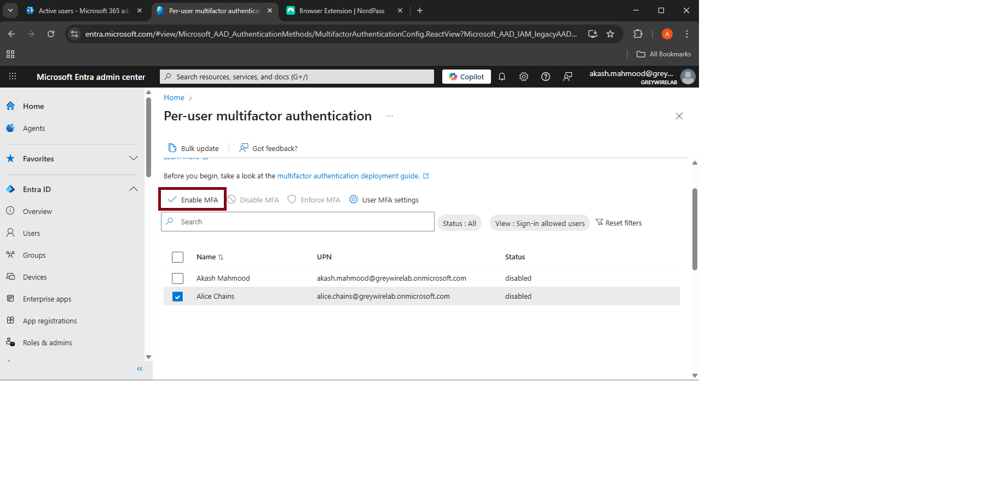
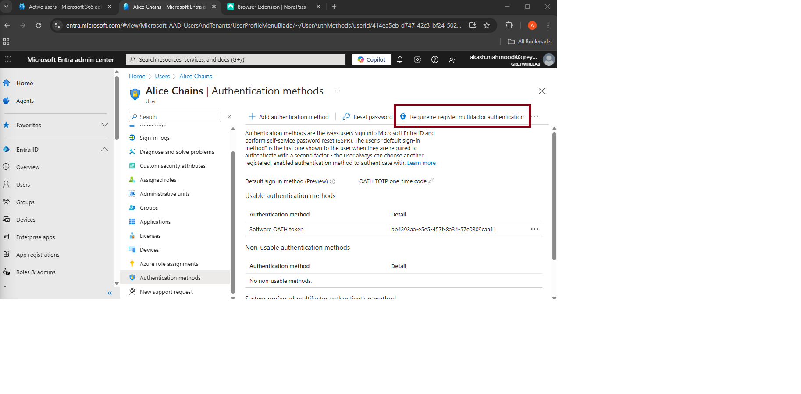
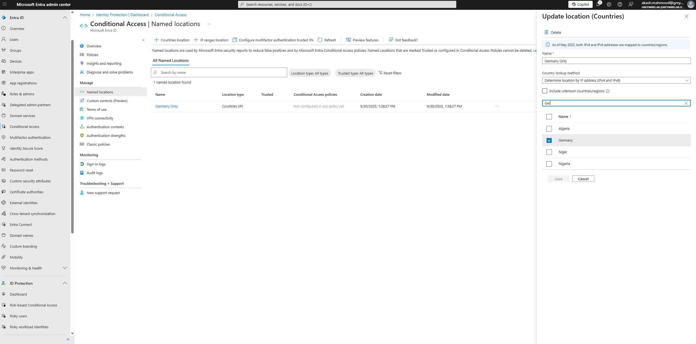
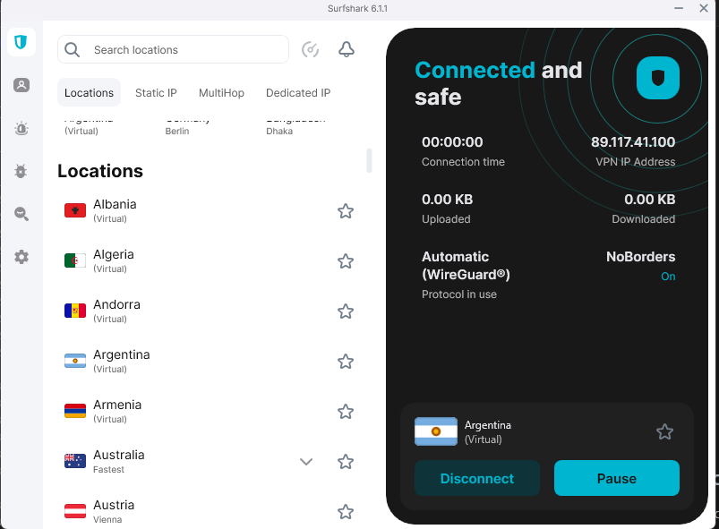
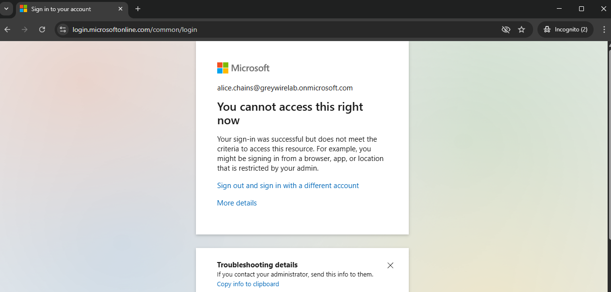

# Lab 01 - Identity & Conditional Access
**Date:** 2025-09-28

## Objective
Enable MFA and Condtional Access policies for test users in Microsoft 365.

## Prerequisities 
- Microsoft 365 Business Premium Tenant
- Global Admin Account
- Two test users: alice@greywirelab.com and bob@greywirelab.com

## Steps Performed
1. Created test users in Microsoft 365 Admin Center.
2. Assigned Business Premium Licenses. 
3. Enabled MFA for users and attempted MFA registration, but intial login failed due to incomplete setup.
4. Re-enforced MFA registration via Microsoft 365 Portal:
    - Admin → Users → Active Users → Select User → Authentication Method → Require re-registertration
5. Configured Conditional Access Policy to block sign-in from no-home IPs.

## Screenshots
- 
- `

# Lab 01 - Identity & Conditional Access(Extended)

## Objective

Block all sign-in from outside Germany using conditional Access.

## Prerequisities
- Microsoft 365 Business Premium Tenant.
- Global Admin access.
- At least one test user account. 
- Knowledge of user's current IP/location(so you dont accidentally block yourself).

## Steps Performed
1. Sign in to Microsoft Entra admin center → https://entra.microsoft.com
2. Go to:
- Condtional Access → Named Locations → Countries Location →  Name this Location(Germany Only) →  Choose Germnay from the list and check. →  Save.
3. Navigate to:
- Conditional Access → Policies → Create New Policy → Name(Block non-Germany sign-in.)
4. Configure the policy:
- Name: Block Non-Germany sign in.
- Assignment → Users: Select test user. I selected Alice Chains as i created as test user on my environment. 
- Target Resources → All Resources(formerly all cloud apps) → Select all resources
- Condtion →  Locations:
                - Include: Any location.
                - Exclude: Germany Only. 
- Access Controls → Grant:
- Select Block access.
5. Set Enable policy →  On.
6. Save the policy. 
7. Test:
- Sign in from VPN or other method 
- Verify that access is blocked. 

## Screenshots
- 
- 
- 

## Outcome / Lessons Learned
- MFA successfully enforced. 
- Condtional Access blocked external logins.